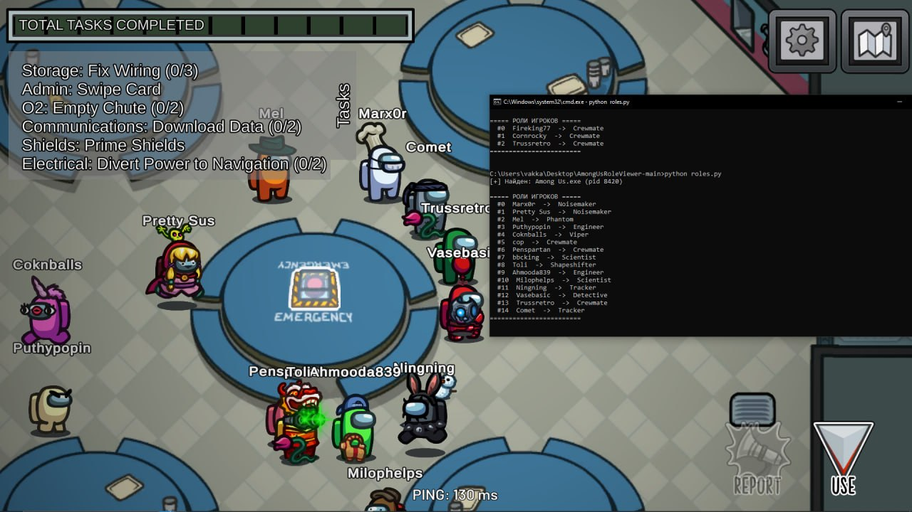

# Among Us — Role Reader (external, Frida)



Скрипт выводит роли всех игроков в текущей игре Among Us через Frida: читает `GameData.Instance.AllPlayers` и достаёт `RoleType` + имя у каждого игрока, ничего не компилируется, инъекция в процесс

Только Windows. На Linux с и без proton нативная Frida не инжектится в процесс внутри песочницы pressure-vessel

## Установка

Нужен Python 3.8+

```cmd
pip install -r requirements.txt
```
Запуск

Запусти Among Us, зайди в лобби или матч (роли существуют, только когда `GameData.Instance` создан), затем:

```cmd
python roles.py
```

или запустить игру под Frida сразу:

```cmd
python roles.py --spawn "C:\Program Files (x86)\Steam\steamapps\common\Among Us\Among Us.exe"
```

## Оффсеты (из дампа Il2Cpp, для справки)

Скрипт резолвит поля по именам в рантайме, поэтому оффсеты не хардкодятся, для справки:

- `NetworkedPlayerInfo.RoleType` — `0x38` (ushort, enum RoleTypes)
- `NetworkedPlayerInfo.Role` — `0x4C` (RoleBehaviour*)
- `GameData.AllPlayers` — `0x10` (List<NetworkedPlayerInfo>)

0=Crewmate 1=Impostor 2=Scientist 3=Engineer 4=GuardianAngel 5=Shapeshifter 6=CrewmateGhost 7=ImpostorGhost 8=Noisemaker 9=Phantom 10=Tracker 12=Detective 18=Viper

- Оффсеты берутся из игры по именам, так что мелкие обновления скрипт может пережить, но если поля переименуют - надо сделать новый дамп

⚠️ Отказ от ответственности (Disclaimer)

Этот проект создан исключительно в образовательных и исследовательских целях - для изучения того, как устроена память Unity/IL2CPP-приложений и как работает Frida.

- Инструмент читает память игрового процесса и не изменяет игру, файлы или сетевой трафик.
- Использование сторонних инструментов в онлайн-играх, включая Among Us, нарушает условия использования (ToS/EULA) и может привести к бану аккаунта. Используй на свой страх и риск, желательно в приватных/локальных играх.
- Автор не несёт ответственности за любой ущерб, баны аккаунтов или иные последствия, возникшие в результате использования этого кода.
- Проект никак не связан с Innersloth (разработчиком Among Us) и не одобрен ими.
- Не используй этот инструмент для получения нечестного преимущества над другими игроками.

Скачивая и запуская этот код, ты соглашаешься с тем, что делаешь это по собственной инициативе и берёшь на себя все связанные риски.
